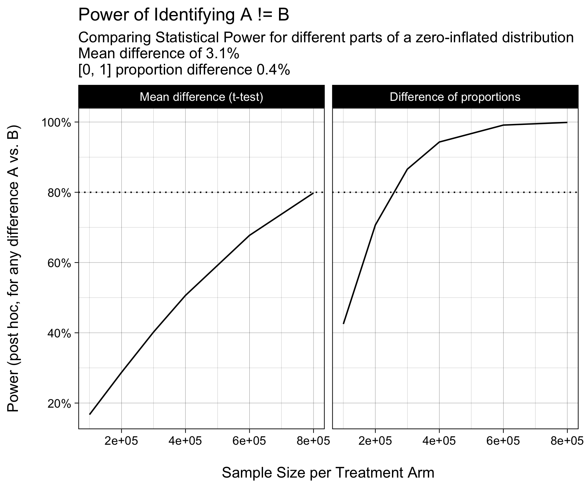
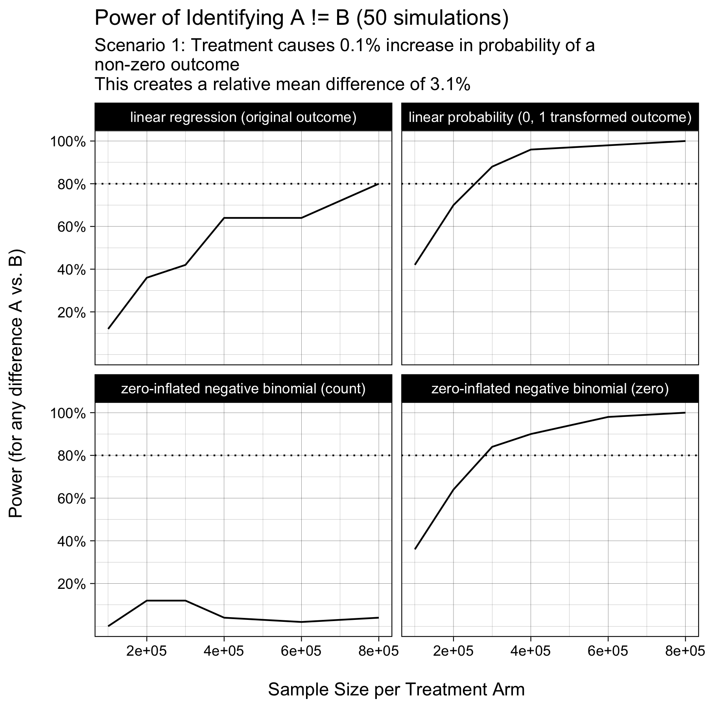
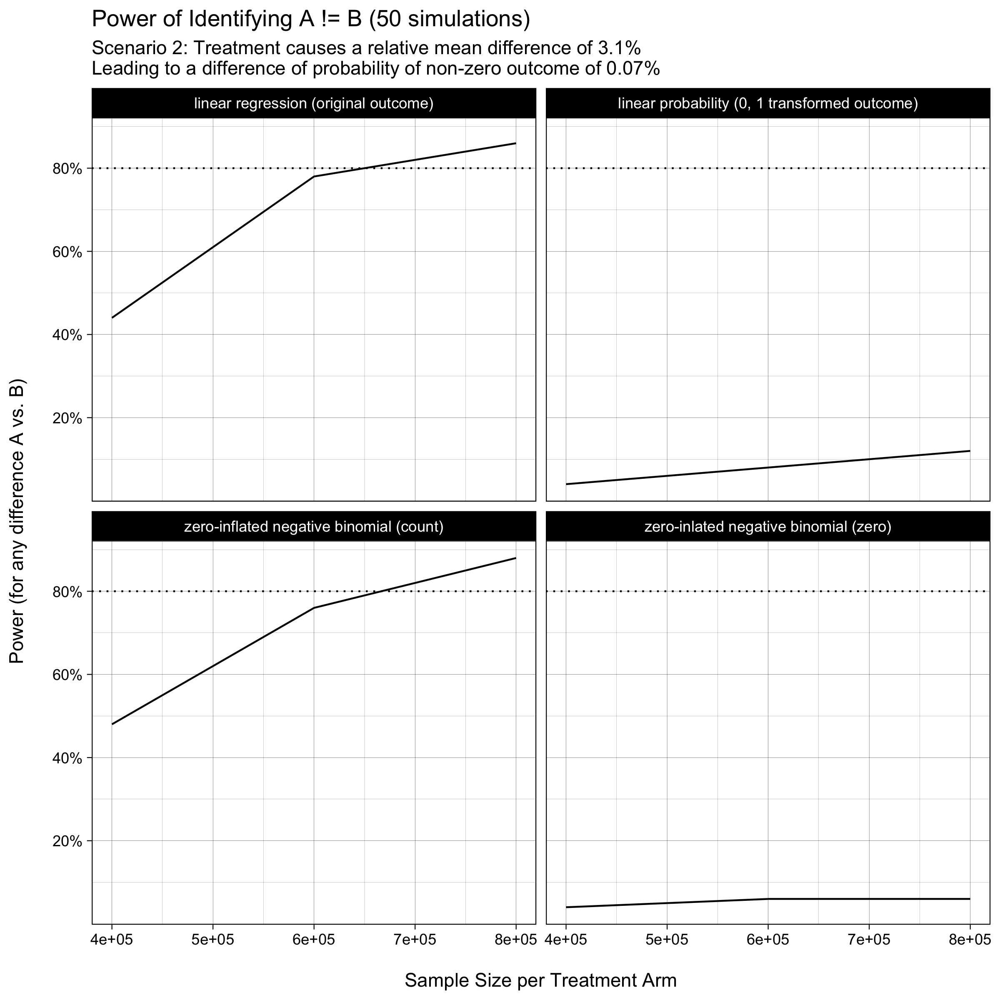

```{r setup, include=FALSE}
library(xfun)
pkg_attach2("tidyverse", "knitr")
theme_set(theme_linedraw())

source("functions.R")
```

# TLDR

You can **dramatically reduce your experimentation time** (by up to 60%) by:

1.   carefully defining how your product will bring value to customers and

2.   **what success looks** (what KPI you improve) when you bring this success. 

Running faster experiments will increase the speed you learn about your product ideas. The faster you learn about the impact of your product ideas, the **faster you will be successful**.

# Step 1: Know our customers to know your product oportunities!

```{r echo=FALSE, out.height="350", cache=TRUE}
one_sim <- tibble(KPI = sim_zeroinf(nsims = 1e6))


ggplot(one_sim, aes(KPI)) +
    geom_histogram(binwidth = 1, color = "orange", fill = "orange") +
    ylab("Number of Customers\n")
```


# Statistical Power for Zero-Inflated Data


```{r echo=FALSE, out.height="500"}

```


## Extreme 1: the product innovation works by creating new value


```{r echo=FALSE, out.height="700"}

```


## Extreme 2: product innovation works by doubling down  


```{r echo=FALSE, out.height="700"}

```

