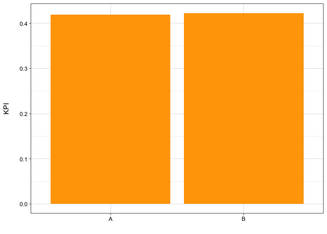

You Won’t Believe How I Cut A/B Test Run time By Up to 60%\!
================
Christopher Gandrud

# TLDR

When you define how a product innovation is likely to bring value to
customers ask:

  - Does it **create new value** for customers who don’t yet get much
    value from existing products?

  - Does it **double down**, making the product even more valuable for
    customers that already benefit from it?

Knowing the answer to these questions will give you clearer product
direction and help you know if you are being successful at delivering
the value you think you are delivering.

It will also help you identify when you can run much **shorter
experiments** (up to 60%). Running faster experiments increases your
product learning speed. The faster you learn about the impact of your
product ideas, the **faster you will be successful**.

# Know our customers

When you start a new product innovation, define the customer problem you
want to solve. Then, think about how you would **measure** if you had
solved this problem. **What actions** you would expect to see customers
taking if you solved it. Do they buy more? Do they visit more? Do they
engage with content more?

Once you know what general type of action customers would take if you
solved their problem, always, always, always, look at the
**distribution** of the actions customers currently take. For example,
look at this percentile plot for some KPI:

What do you see?

Over 50% of customers have a 0 for this KPI. They don’t take this action
at all\!

Remember this. It is crucial information. Many (most?) of the basic
e-commerce KPIs usually have a similar **highly skewed** distribution.
Most of our customers don’t take the action that the KPI is measuring,
or they don’t do it very much. Most customers don’t add anything to cart
in a month. Most customers don’t buy anything in a month. Most customers
don’t use Search more than one day in a month. Most customers who visit
the site in a month only visit once or twice. Etc. Etc. Etc.

A highly skewed KPI distribution like this often indicates that we have
two broad types of customers:

  - Customers who **don’t currently get much value** from our service.
    They have low or 0 values of the KPI.

  - Customers who **do get value** from our service. They have high KPI
    values.

In these cases, there are two big product opportunities:

  - **create new value**: making products work for customers we don’t
    currently bring enough value to

  - **doubling down**: making products that already work for some
    customers, work even better for them

You will gain a lot of **product direction clarity** and possibly
**experimentation speed** by using different KPIs to measure success on
these two value creation opportunities.

Why?

# Product direction

Imagine you want to build a product that helps customers who have a hard
time finding what they like on our site. By doing this, you anticipate
that we will earn more revenue; customers who don’t buy much (or at all)
will buy more. Should you use revenue per customer as your primary
success KPI?

No.

What is revenue per user? It is the average revenue a customer spends.
Remember that, like almost all of our KPIs, revenue per user is highly
skewed. Most people buy nothing and some people buy a lot. If you test
your new product and revenue per user goes up, is this because you now
bring new value to the customers you targeted? Or did you marginally
improve the experience for customers who already buy a lot?

You can’t tell by looking at overall revenue per user\! Average revenue
could go up because there are a lot more customers making a first or
second purchase they wouldn’t have otherwise *or* because a few high
spending users spend even more.

In general, consider defining success like this:

| Who are you bringing value to? | Type of success KPI | Statistical name | Example                                                                 |
| ------------------------------ | ------------------- | ---------------- | ----------------------------------------------------------------------- |
| Creating new value             | Action/No Action    | Binary           | Used search 2 days+ in 7, or not                                        |
| Doubling down                  | Amount of action    | Continuous       | Revenue per user (ideally for customer that were already likely to buy) |

Important: **repeated actions** (e.g. 2+ days using search) are
generally more valuable indicators that you brought new value to
customers. It is rare that a customer would do something multiple times
on distinct days, if they weren’t getting value out of it.

If you use these types of success metrics, you will be able to better
understand if your product is successful for the reasons you
anticipated.

Why does it matter to know if you are creating new value or doubling
down? It matters because it **indicates how big your product impact
could be**, given your customer base.

If you already serve all of the customers pretty well, then most of your
opportunity will be in doubling down on their experience.

If there is a large chunk of customers who you serve poorly, then there
is a lot of opportunity by creating new value for them. Even if you
don’t move the overall average much in one experiment for these
customers, bringing them new value you will likely grow your retained
customer base and so customer lifetime value.

# Faster A/B tests

How can choosing the right types of KPIs help make you experiments
faster?

## Short answer

  - You need **smaller sample sizes** to consistently detect an effect
    for **action/no action KPIs** (e.g. 2+ visits, or not).

  - You need **larger sample sizes** to consistently detect an effect on
    KPIs that measure the **amount of an action** (e.g. revenue per
    user).

## Long answer

When you run an experiment, you want to be confident that you will
consistently detect that your product has an effect, when in reality it
does have an effect. This is called **statistical power**. A general
rule of thumb is that you want **80% power**: you want to correctly
detect an effect when there is one 80% of the time. It different samples
sizes to detect an effect at the 80% level for different types of KPIs.

Imagine that we run an A/B test. The results look like this:

Did our product innovation (group B) work? Did the product innovation
statistically significantly change customer behavior?

We can answer this question (at least) two ways. The first is to compare
the **difference of mean** KPI values for the A and B groups using a
statistical test called a **t-test**.

We ask a different question. Do more customers take the action at all in
group B? To do this, we transform the data into the **proportion** of
customers with KPI greater than 0:

These two tests have **very different statistical power**:

To detect a difference of proportions, we reach the 80% power level at
about 300,000 customers per treatment arm (A or B). It takes us 800,000
customers per treatment arm to detect the difference of means. The test
would need to run over **twice as long** (in reality it would probably
take even longer, because the longer you run a test, the slower new
customers enter the test).

Of course the difference of means and difference of proportions tell you
different things. The first tells you how much you have moved the KPI
average, this could be because your product converts customers by
bringing new value or because it has doubled down and made a product
that works for some customers, work even better for them.

But if you are focused on creating a product that brings new value, it
is less important to move the needle with customers that already get
value from your product. You can focus your experiments on identifying
an impact on increasing the proportion of customers that take
significant new actions. If you do this, you can run shorter tests.

If you are focused on doubling down, moving up the average for the
already high spenders, then you will likely need to run the test for the
longer time period. Sorry.

# Annex 1: What about post-stratification and segmentation?

Why not use pre-treatment co-variate adjustment to reduce the variance?
We could even measure the latent customer value states: currently gets
value, currently doesn’t get value (for example see [Berman and Feit
(2019)](https://arxiv.org/pdf/1911.08438.pdf)). This is a great idea. We
can also do that.

However, there are two reasons why product managers should also do what
we suggest above:

1.  It’s easy to implement and maintain. There are no new ETLs, we don’t
    need any additional customer data, there are no models that need to
    be refined and maintained.

2.  Our goal with experimentation is not to just run short experiments,
    it’s for product managers to learn about how their product is
    impacting customers. This is a simple, fairly easy to explain, way
    to gain new insights now.

# Annex 2: Simulations to show this works

I ran some simulations to see how different methods work at consistently
identifying true “double down” (average differences) and “creating
value” effects (different proportions of customer actions). These
methods include:

  - linear regression to identify differences of means (same as a
    t-test)

  - linear probability model to identify if there is a difference of
    proportions of customers that have a KPI value above a certain level

  - [zero-inflated
    regression](https://www.google.com/search?q=zero+inflated+regression+university+of+virginia&oq=zero+inflated+regression+university+of+virginia&aqs=chrome..69i57.9314j0j7&sourceid=chrome&ie=UTF-8)
    does both at the same time

## Extreme 1: Product only creates new value (increases proportion of customers taking the minimum action)

The linear probability model and the zero inflated regression (zero
component) both correctly identify the true effect at similar rates and
sample sizes. The linear regression does not identify an effect
consistently until sample sizes that are more than twice as large.

## Extreme 2: product innovation works by doubling down (moves average for customers who already take the minimum action)

The linear regression and zero inflated regression (count component)
both correctly identify the true effect at similar rates and sample
sizes.
