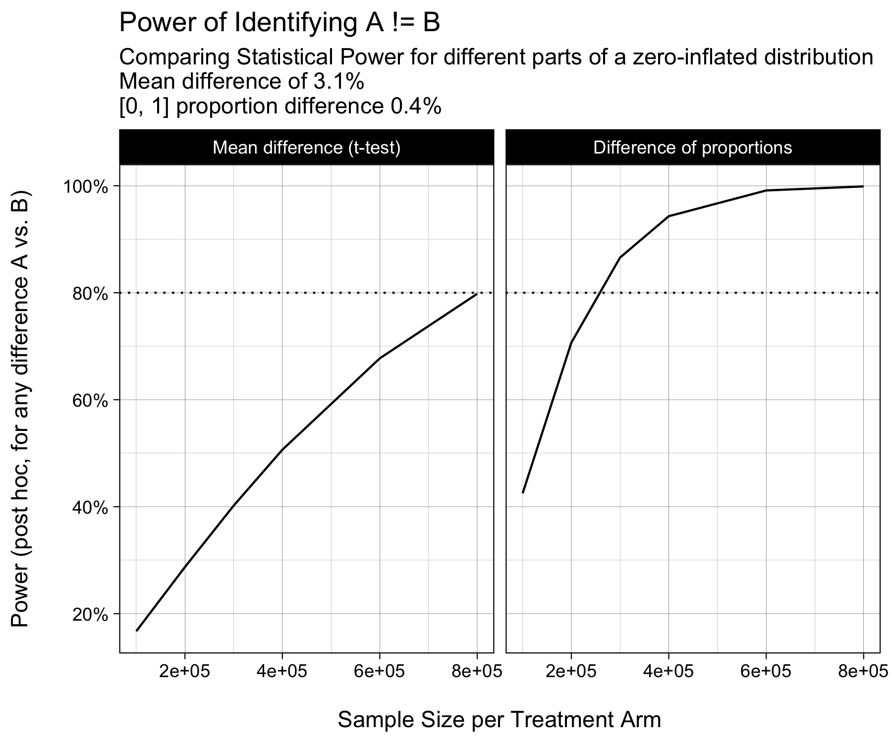
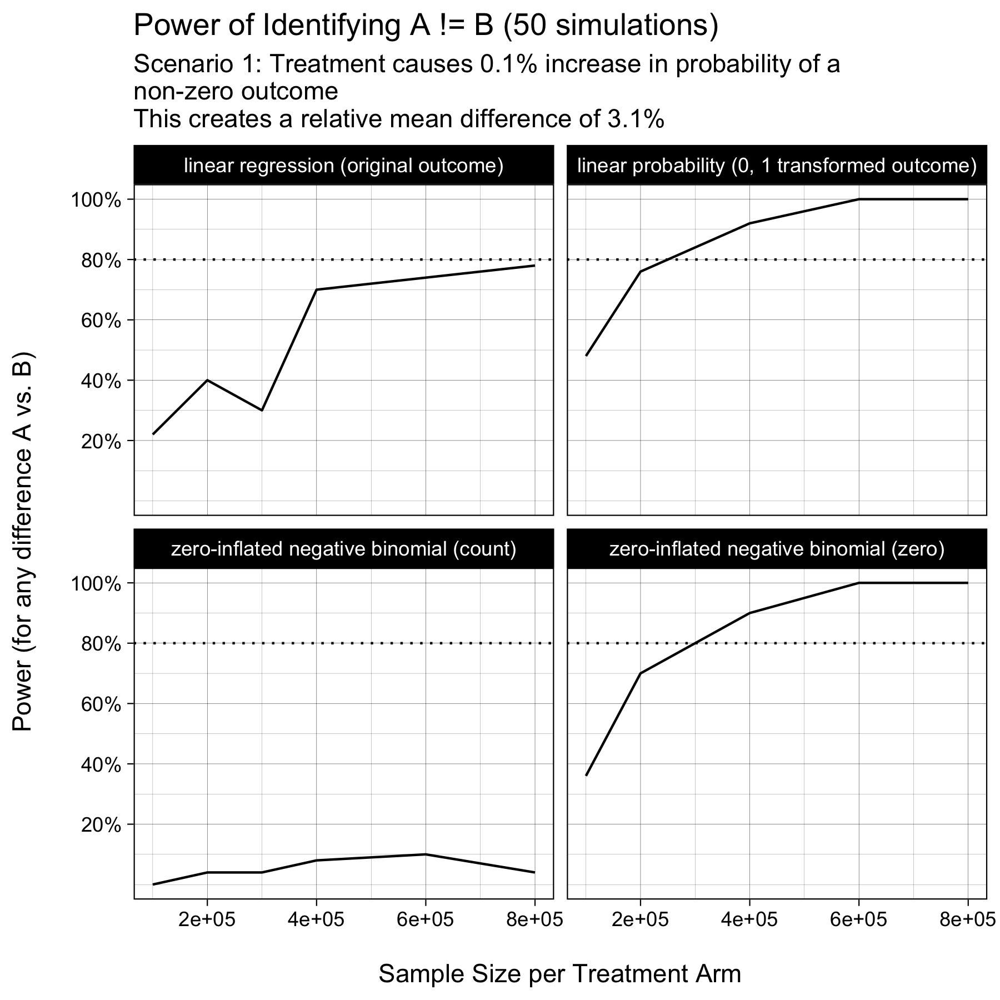

You Won’t Believe How I Cut Experiment Runtime By Up to 60%\!
================
Christopher Gandrud

# TLDR

You can **dramatically reduce your experimentation time** (by up to 60%)
by:

1.  carefully defining how your product will bring value to customers
    and

2.  **what success looks** (what KPI you improve) when you bring this
    success.

Running faster experiments will increase the speed you learn about your
product ideas. The faster you learn about the impact of your product
ideas, the **faster you will be successful**.

# Step 1: Know our customers to know your product oportunities\!

# Statistical Power for Zero-Inflated Data

## Extreme 1: the product innovation works by creating new value

## Extreme 2: product innovation works by doubling down

